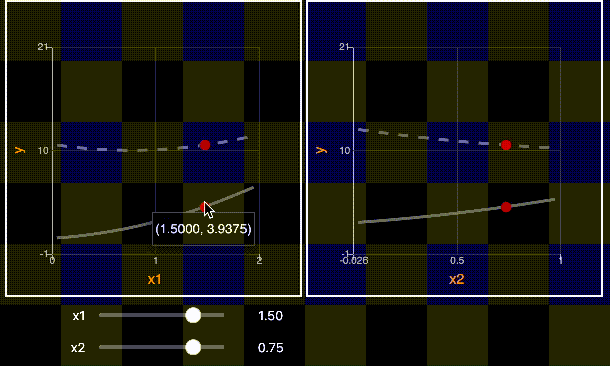

# ipysensitivityprofiler

<!-- [](https://mybinder.org/v2/gh/shb84/ipysensitivityprofiler.git/main) -->

Jupyter Widgets for visualizing local sensitivities of vectorized functions with signature `y = f(x)` where `x,y` are arrays.


--- 
## Installation

```
pip install ipysensitivityprofiler
```

--- 
## Example  

Example notebooks are available for download on [GitHub](https://github.com/shb84/ipysensitivityprofiler/tree/main/notebooks).

--- 
## Documentation 

Documentation is available [here](https://shb84.github.io/ipysensitivityprofiler/) (generated using [`sphinx`](https://www.sphinx-doc.org/en/master/))

--- 
## Usage

```
import numpy as np
import ipysensitivityprofiler as isp

def quadratic1(x):
    """y = x1**2 + x2**2 + x1*x2"""
    return (np.prod(x, axis=1) + np.power(x, 2).sum(axis=1))

def quadratic2(x):
    """y = 10 + x1**2 + x2**2 - 2 * x1*x2"""
    return (10 - 2 * np.prod(x, axis=1) + np.power(x, 2).sum(axis=1))

isp.profiler(
    models=[quadratic1, quadratic2], 
    xmin=[0, 0],
    xmax=[2, 1],
    ymin=[0],
    ymax=[20],
    x0=[1.5, 0.75],
    resolution=10_000, 
    xlabels=["x1", "x2"],
    ylabels=["y"],
)
```



---
# Main Features

* Visualize multiple outputs against multiple inputs interactively 
* Overlay more than one model at once
* Download pictures on individual plots (by clicking on red dot)

--- 
## License
Distributed under the terms of the MIT License.
