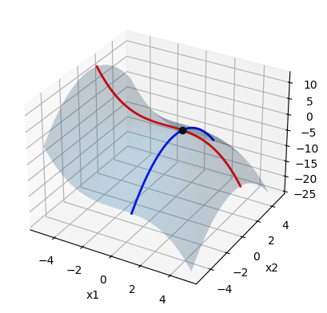
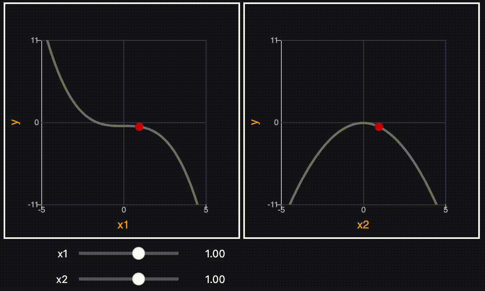
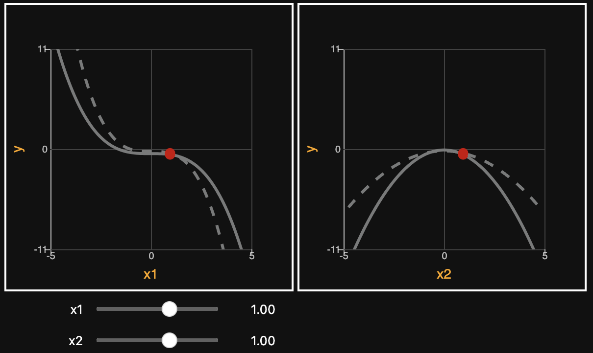

.. ipysensitivityprofiler documentation master file, created by
   sphinx-quickstart on Sun Jan 23 10:35:00 2024.
   You can adapt this file completely to your liking, but it should at least
   contain the root `toctree` directive.

Welcome to ipysensitivityprofiler's documentation!
==================================================

Jupyter Widgets for visualizing local sensitivities of callable Python functions in a notebook. 

What is a sensitivity profile? 
------------------------------
A local sensitivity profile is the trace of a function obtained by holding all dimensions fixed but one, 
as shown below. It can be thought of as the intersection of a cartesian plane (in which only one input is  
changing) and the response surface of interest.  

.. collapse:: show code

   .. code-block:: python 

      import numpy as np
      import matplotlib.pyplot as plt
      from mpl_toolkits.mplot3d import Axes3D

      # Define equation 
      def f(x): 
         return -0.1 * x[0] ** 3 - 0.5 * x[1] ** 2

      # Point about which to evaluate sensitivities
      x0 = np.array([[1], [1]])
      y0 = f(x0)

      # Define bounds of design space
      lb = [-5, -5]  # x1_min, x2_min
      ub = [ 5,  5]  # x1_max, x2_max

      # Grid coordinates per dimension (for plotting response surface)
      resolution = 100
      x1 = np.linspace(lb[0], ub[0], resolution).reshape((1, -1)) 
      x2 = np.linspace(lb[0], ub[0], resolution).reshape((1, -1))
      X1, X2 = np.meshgrid(x1, x2)
      x = np.concat([X1.reshape((1, -1)), X2.reshape((1, -1))])  # flatten grid
      y = f(x)  # evaluate points 
      Y = y.reshape(X1.shape)  # reshape grid 

      # Plot response surface 
      fig = plt.figure()
      ax = fig.add_subplot(111, projection='3d')
      ax.plot_surface(X1, X2, Y, alpha=0.25) 

      # Plot profile along x1 
      x = np.concatenate([x1, x2])
      x[1, :] = x0[1]
      y = f(x)
      ax.plot(x[0], x[1], y, alpha=1, color='red', linewidth=2)

      # Plot profile along x2 
      x = np.concatenate([x1, x2])
      x[0, :] = x0[0]
      y = f(x)
      ax.plot(x[0], x[1], y, alpha=1, color='blue', linewidth=2)

      # Plot point about sensitivities are evaluated
      ax.plot(x0[0], x0[1], y0, "ko")
      ax.set_xlabel("x1")
      ax.set_ylabel("x2")
      ax.set_zlabel("y")
      plt.show()

.. toctree::
   :maxdepth: 2
   :caption: Contents:

Example Usage
-------------

.. collapse:: show code

   .. code-block:: python 

      import ipysensitivityprofiler as isp

      def f(x): 
         return -0.1 * x[:, 0] ** 3 - 0.5 * x[:, 1] ** 2

      isp.profiler(
         models=[f], 
         xmin=[-5, -5],
         xmax=[5, 5],
         ymin=[-10],
         ymax=[10],
         x0=[1, 1],
         resolution=100, 
         xlabels=["x1", "x2"],
         ylabels=["y"],
      )

Audience
--------

The present library is intended for engineers who rely on modeling and simulation 
to make engineering design decisions. For example, developing physics-based or 
empirical models (e.g. neural net) to make predictions about some system of interest 
or run optimization on it. 

Use Cases 
---------

**Debugging models**. The ability to quickly interrogate the model(s) and 
get instantaneous feedback goes a long way in spotting obviously wrong trends early 
on. This is especially helpful when developing physics-based models, before using them 
for optimization or design decision-making. It's often easier to look at trends 
to understand what is going on, rather than infer the issue from stack error messages.  

**Robust design**. Upon convergence, the design team might be 
interested in understanding how system performance would change if the design was 
perturbed away from nominal. This could be the result of noise in the process, requirement
changes down the road, or operational uncertainty. Perturbing inputs allows 
engineers to verify whether system outputs would stay within desired limits based on their model(s). 

**Model comparison**. Taking advantage of the tool's ability to render multiple 
models of the same thing on the same plot, this enables two or more models to be compared against 
each other. For example, one model might be the high fidelity model, the other some low-fidelity 
version, and perhaps the third is ground truth. Provided each model has the same signature, one 
can very quickly observe where they disagree, as illustrated below. 

.. collapse:: show code

   .. code-block:: python 

      import ipysensitivityprofiler as isp

      def f1(x): 
         return -0.1 * x[:, 0] ** 3 - 0.5 * x[:, 1] ** 2

      def f2(x): 
         return -0.2 * x[:, 0] ** 3 - 0.25 * x[:, 1] ** 2

      isp.profiler(
         models=[f1, f2], 
         xmin=[-5, -5],
         xmax=[5, 5],
         ymin=[-10],
         ymax=[10],
         x0=[1, 1],
         resolution=100, 
         xlabels=["x1", "x2"],
         ylabels=["y"],
      )

Data Structures
---------------

The response :math:`f` can be any callable Python function that maps :math:`\boldsymbol{x}` to :math:`\boldsymbol{y}`, 
provided it is vectorized and adopts the following signature: 

.. math::

   \boldsymbol{y} = f(\boldsymbol{x}) 

where :math:`\boldsymbol{x}` and :math:`\boldsymbol{y}` are multidimensional arrays defined below, in which 
:math:`n_x` is the number of inputs, :math:`n_y` is the number of outputs, and :math:`m` is the number of examples: 

.. math::

   \boldsymbol{x} 
   =
   \left(
   \begin{matrix}
   x_1^{(1)} & \dots & x_{n_x}^{(1)} \\
   \vdots & \ddots & \vdots \\
   x_{1}^{(m)} & \dots & x_{n_x}^{(m)} \\
   \end{matrix}
   \right)
   \in 
   \mathbb{R}^{m \times n_x}
   \qquad 
   \boldsymbol{y} 
   =
   \left(
   \begin{matrix}
   y_1^{(1)} & \dots & y_{n_x}^{(1)} \\
   \vdots & \ddots & \vdots \\
   y_{1}^{(m)} & \dots & y_{n_x}^{(m)} \\
   \end{matrix}
   \right)
   \in 
   \mathbb{R}^{m \times n_y}

Limitations
-----------

Models must be fast for interactivity. Concretely, they must be 
able to evaluate thousands of datapoints on the order of milliseconds. This is a 
non-issue when the model at hand is some empirical regression (e.g. neural net) or even some first-order 
physics-based model.

The other limitation is screen realestate. This library is helpful for understanding how multiple 
responses and factors interact but, beyond a certain point, the number of inputs and outputs might 
be so big that human become overwhelmed with information and screen realestate runs out. Hence, 
this library is best suited for targeted studies on a subspace of a larger problem.

.. toctree::
    :numbered:
    :caption: API Docs
    :hidden:

    api

